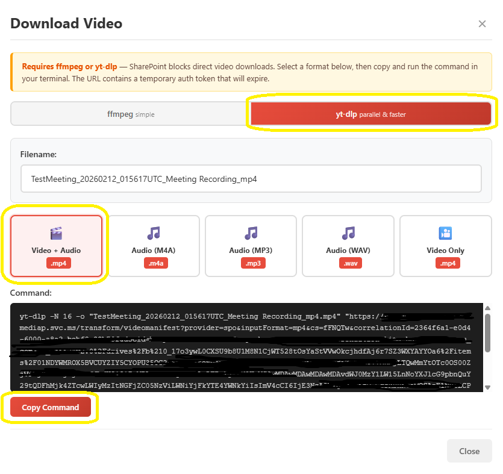
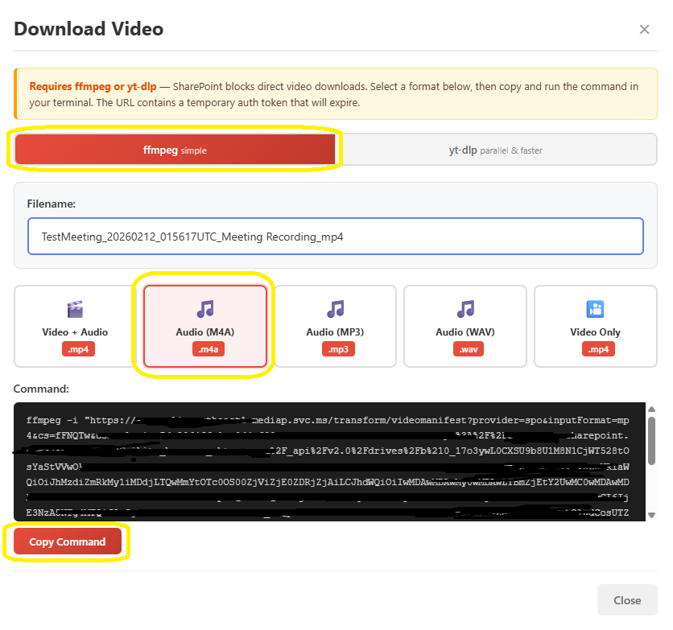
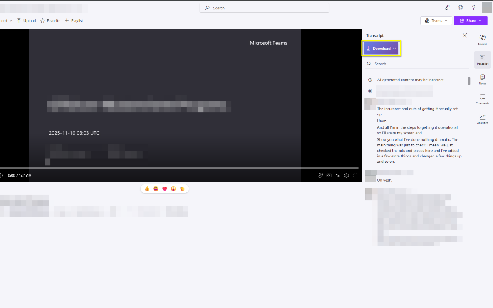
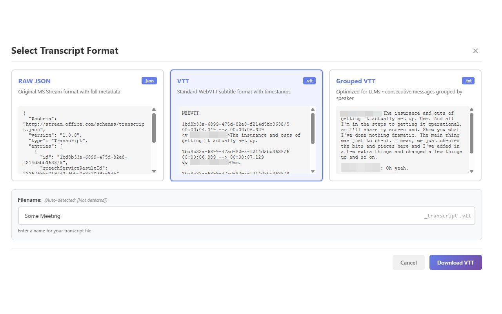

# MS Teams Video & Transcript Downloader - Chrome Extension

A Chrome extension that allows you to download MS Teams meeting recordings (video/audio) and transcripts, even when downloads are disabled due to permissions.

This works for both `teams.microsoft.com` (Web Teams) and `*.sharepoint.com` meeting recording links.

## Features

### Video/Audio Download
- 🎬 **Video Download**: Adds a "Download Video" button to the top command bar
- 🔧 **Two Tools**: Choose between **ffmpeg** (simple) or **yt-dlp** (parallel & faster)
- 🎵 **5 Format Options**: Video + Audio (.mp4), Audio Only (.m4a, .mp3, .wav), Video Only (.mp4)
- 📋 **Copy-to-Clipboard**: Generates ready-to-use terminal commands — just paste and run
- ✏️ **Editable Filename**: Auto-detected from page title, fully customizable
- ⚡ **Parallel Downloads**: yt-dlp mode uses `-N 16` for 16 concurrent fragment downloads

### Transcript Download
- 🎙️ **Automatic Detection**: Detects when you're viewing a Teams transcript
- 📥 **Multiple Formats**: Download transcripts as RAW JSON, VTT, or Grouped VTT
- 👤 **Speaker Names**: Preserves speaker display names in all formats
- 🔍 **Live Previews**: Preview transcript in each format before downloading
- 💾 **Easy Download**: Adds a custom "Download Transcript" button to the transcript panel
- 🎨 **Format Selection**: Choose your preferred format via extension popup or modal dialog

## Screenshots

### Video Download Modal — yt-dlp (Parallel & Faster)



Select a format, choose yt-dlp for parallel downloads, and copy the generated command.

### Video Download Modal — ffmpeg (Simple)



ffmpeg mode generates straightforward commands for any format.

### Teams Recording Page



The extension adds a "Download Video" button in the top command bar and a "Download Transcript" button in the transcript panel.

## Installation

### Method 1: Load Unpacked Extension (Development)

1. **Download or Clone** this repository to your local machine

2. **Open Chrome Extensions Page**:
   - Navigate to `chrome://extensions/`
   - Or click the three-dot menu → More Tools → Extensions

3. **Enable Developer Mode**:
   - Toggle the "Developer mode" switch in the top-right corner

4. **Load the Extension**:
   - Click "Load unpacked"
   - Navigate to the `src` folder in this repository
   - Select the folder and click "Select Folder"

5. **Verify Installation**:
   - You should see "MS Teams Transcript Downloader" in your extensions list
   - The extension icon should appear in your Chrome toolbar

### Method 2: Install from Chrome Webstore

1. **Open Extension Page**: 
   - Navigate to https://chromewebstore.google.com/detail/ms-teams-transcript-downl/hmljlkhcebhkkhbbafiheolbneecoinp 
   - Click on `Add to Chrome`

## Usage

### Downloading Video/Audio

1. **Navigate to a Teams Meeting Recording**:
   - Open a MS Teams meeting recording on SharePoint
   - A red **"Download Video"** button appears in the top command bar

2. **Click "Download Video"**:
   - A modal dialog opens with format and tool options

3. **Choose Your Tool**:
   - **ffmpeg** — Simple, widely available. Downloads segments sequentially
   - **yt-dlp** — Parallel downloads (`-N 16`), significantly faster for large recordings

4. **Select a Format**:
   - **Video + Audio** (.mp4) — Best quality, original streams copied
   - **Audio Only** (.m4a / .mp3 / .wav) — Extract just the audio
   - **Video Only** (.mp4) — No audio track

5. **Copy and Run**:
   - Edit the filename if needed (auto-detected from page title)
   - Click **"Copy Command"** to copy the generated command
   - Paste into your terminal and run

   > **Note**: The URL contains a temporary auth token that will expire. Generate and use the command promptly.

### Downloading Transcripts

1. **Navigate to a Teams Meeting Recording**:
   - Open a MS Teams meeting recording that has a transcript
   - Click on the "Transcript" tab to view the transcript

2. **Wait for the Extension**:
   - The extension automatically detects the transcript page
   - It intercepts MS Teams API calls to capture the transcript metadata
   - A purple **"Download Transcript"** button appears in the transcript panel

3. **Download the Transcript**:
   - Click the **"Download Transcript"** button
   - A modal dialog appears with three format options and live previews
   - Choose your preferred format:
     - **RAW JSON**: Original API response with full metadata and speaker names
     - **VTT**: Standard WebVTT format with speaker labels and timestamps
     - **Grouped VTT**: Text format with consecutive messages grouped by speaker
   - Click "Download" to save the transcript

   

4. **Set Default Format** (Optional):
   - Click the extension icon in the Chrome toolbar
   - Select your preferred default format
   - Future downloads will skip the modal and use your preference

   

## How It Works

### Architecture

```
┌─────────────────────────────────┐
│  MS Teams / SharePoint Page     │
│  (iframe embedded in main page) │
└────────┬────────────────────────┘
         │
         │ 1. Fetch API calls intercepted
         ▼
┌─────────────────────────────────┐
│  intercept.js (MAIN world)      │
│  - Intercepts fetch() calls     │
│  - Captures transcript metadata │
│  - Detects videomanifest URLs   │
│  - Reads g_fileInfo fallback    │
│  - Posts to window              │
└────────┬────────────────────────┘
         │
         │ 2. postMessage (TRANSCRIPT_METADATA / VIDEO_MANIFEST_URL)
         ▼
┌─────────────────────────────────┐
│  content.js (ISOLATED world)    │
│  - Receives transcript URL      │
│  - Receives video manifest URL  │
│  - Injects Download buttons     │
│  - Handles format conversion    │
│  - Shows transcript format modal│
│  - Shows video download modal   │
│  - Generates ffmpeg/yt-dlp cmds │
└────────┬────────────────────────┘
         │
         │ 3. Transcript: Fetch with ?format=json
         │    Video: User runs ffmpeg/yt-dlp command
         ▼
┌─────────────────────────────────┐
│  MS Teams API / SharePoint CDN  │
│  - temporaryDownloadUrl (JSON)  │
│  - videomanifest (DASH stream)  │
└─────────────────────────────────┘
```

### API Interception

**Transcripts**: The extension intercepts MS Teams API calls to the transcript metadata endpoint:
```
/_api/v2.1/drives/{driveId}/items/{itemId}/media/transcripts
```

This endpoint returns a `temporaryDownloadUrl` which can be used to fetch the transcript:
- `temporaryDownloadUrl` (default): Returns WebVTT format
- `temporaryDownloadUrl?format=json`: Returns JSON with full metadata

**Video**: The extension detects `videomanifest` URLs from fetch requests or extracts them from the `g_fileInfo` global variable. These DASH manifest URLs are used to generate ffmpeg/yt-dlp commands for downloading.

### Format Conversion

1. **RAW JSON**: Direct download from API with `?format=json` parameter
   - Contains: `entries[]` with `speakerDisplayName`, `startOffset`, `endOffset`, `text`, `id`
   
2. **VTT**: Converted from JSON
   - Standard WebVTT format with timestamps
   - Cue identifiers use speaker IDs
   - Speaker names in NOTE comments
   
3. **Grouped VTT**: Converted from JSON
   - Groups consecutive messages by the same speaker
   - Format: `Speaker Name:\nMessage 1\nMessage 2\n\n`
   - Preserves chronological order

## Files Structure

```
chrome-extension/
├── manifest.json       # Extension configuration (Manifest V3)
├── intercept.js        # Fetch interceptor (MAIN world, runs at document_start)
├── content.js          # Main extension logic (ISOLATED world, runs at document_idle)
├── background.js       # Background service worker (stores transcript metadata)
├── modal.css           # Format selection modal styles
├── popup.html          # Extension popup UI
├── popup.js            # Popup logic (format preferences)
└── icons/
    └── icon128.svg     # Extension icon
```

## Permissions

The extension requires the following permissions:

- **`storage`**: To store user's format preferences
- **Host permissions**: Access to `teams.microsoft.com` and `*.sharepoint.com` where Teams transcripts are hosted
- **Content Script MAIN world**: To intercept fetch() calls in the page context

## Troubleshooting

### Button Doesn't Appear

1. **Refresh the page** after installing the extension
2. **Check the console** (F12) for error messages (look for `[MS Teams Transcript]` logs)
3. **Verify** you're on a Teams transcript page (URL should contain `teams.microsoft.com` or `sharepoint.com`)
4. **Wait a few seconds** - the button is injected after the API call is intercepted

### Download Fails

1. **Check the browser console** for error messages
2. **Verify** the transcript has loaded properly in the Teams UI
3. **Try refreshing** the transcript page to trigger a new API call
4. **Check** that you have permission to view the transcript

### Modal Doesn't Show

1. **Check console** for errors during format conversion
2. **Verify** the JSON data was captured (check console logs)
3. **Try clicking** the Download button again

### Extension Not Working

1. **Reload the extension**:
   - Go to `chrome://extensions/`
   - Click the reload icon on the extension card
2. **Check Developer Mode** is enabled
3. **Clear browser cache** and reload the Teams page
4. **Check** that both `intercept.js` and `content.js` are loading (F12 → Sources tab)

## Privacy & Security

- ✅ **No data is sent to external servers** - all processing happens locally in your browser
- ✅ **No tracking or analytics**
- ✅ **Open source** - review the code yourself
- ✅ Uses MS Teams' official API endpoints (temporaryDownloadUrl)

## Development

### Testing

1. Load the extension in Chrome
2. Navigate to a Teams meeting with transcript
3. Open DevTools (F12) and check the Console
4. Look for `[MS Teams Transcript Downloader]` log messages

### Debugging

Enable verbose logging in the console:
1. Open the Teams transcript page
2. Press F12 to open DevTools
3. Go to Console tab
4. Look for `[MS Teams Transcript]` messages
5. Debug-level logs show detailed format conversion info
6. Check Network tab for API calls to `/transcripts` endpoints

## Known Limitations

- Only works on Teams transcripts/recordings accessible via the web interface
- Requires the transcript API call to be intercepted (happens when viewing the transcript)
- Cannot bypass access restrictions — only works if you can view the content
- Chrome/Edge only (Manifest V3)
- Must have the Transcript tab open for transcript detection
- Video download requires **ffmpeg** or **yt-dlp** installed locally
- Video manifest URLs contain temporary auth tokens that expire after a period

## License

MIT License - See LICENSE file for details

## Contributing

Contributions are welcome! Please:
1. Fork the repository
2. Create a feature branch
3. Make your changes
4. Submit a pull request

## Support

If you encounter issues:
1. Check the troubleshooting section above
2. Review the browser console for errors
3. Open an issue on GitHub with details

## Credits

Created as a tool to help access your own Teams meeting transcripts and recordings when download is disabled due to organizational permissions.

---

**Note**: This tool is intended for accessing your own meeting transcripts and recordings. Please respect copyright and privacy policies when using this extension.
